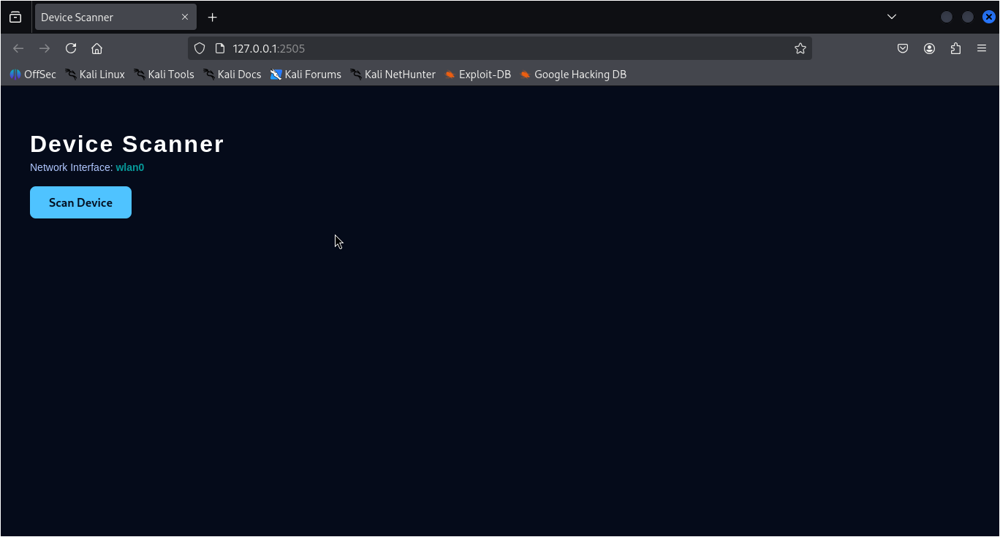
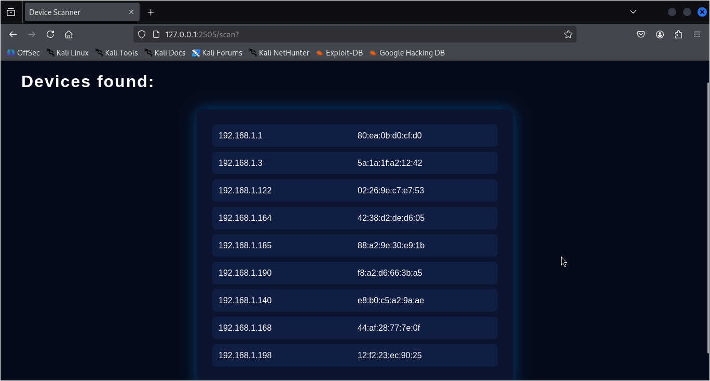

# network-device-scanner

It scans and displays the devices on the network to which the computer is connected

---

## How It Works

The application runs locally on:

- **Address:** `127.0.0.1`
- **Port:** `2505`

### Application Flow

1. When the application is started, it first checks whether the host computer is connected to any network.
2. If a network connection is detected, the web interface is loaded.
3. The user initiates the scan by clicking a button on the web page.
4. The application sends **ARP requests** to the local network using Scapy.
5. Devices that respond to these ARP packets are detected.
6. The results are displayed as a list of:
   - IP addresses
   - Corresponding MAC addresses
7. If no active devices are found, an error message is shown on the page.

## Technologies Used

- **Flask** – for the web interface
- **Scapy** – for low-level network packet handling (ARP scanning)

---

## Notes
- The application must be run with sufficient privileges to send ARP packets (user sudo)
- This application is only for allowing you to see the devices or appliances connected to your home modem

---

## Screenshot's

This tool is developed for learning and testing purposes on networks you own or have permission to analyze.
The author is not responsible for misuse of this software.
